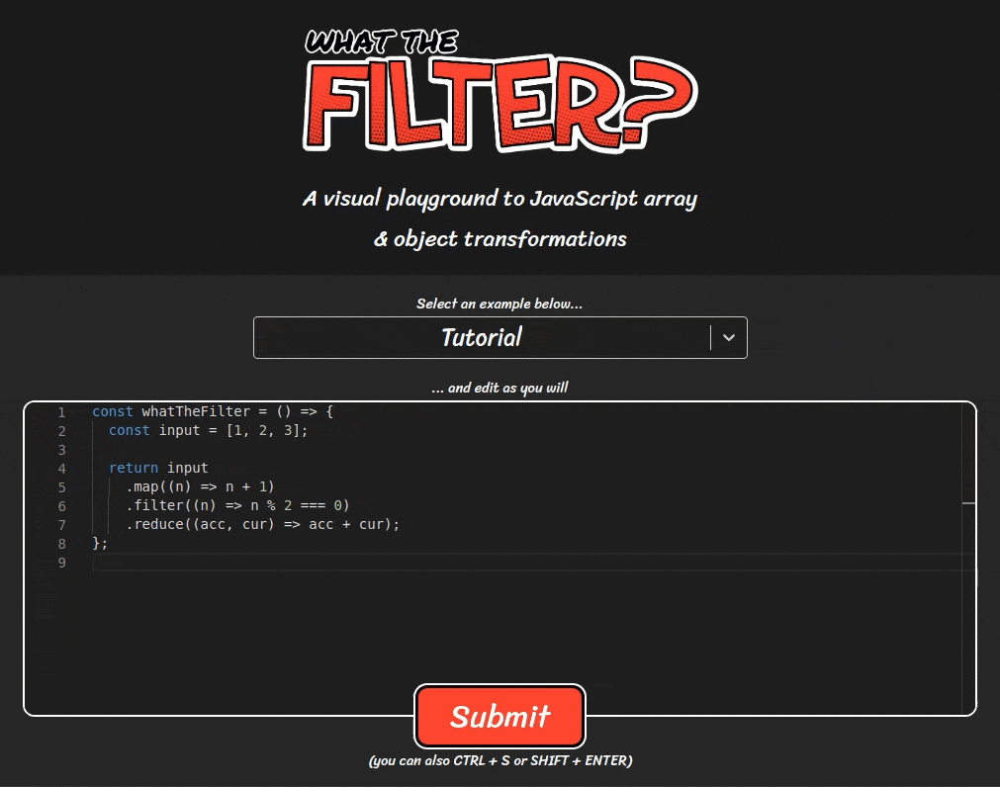
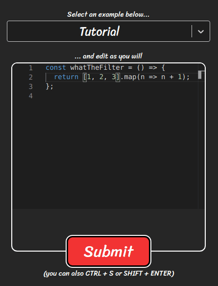
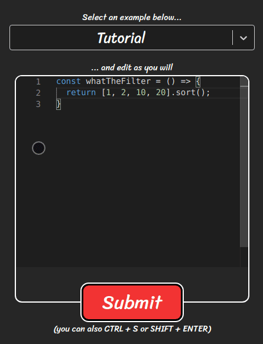

# what the filter?
## A visual playground to JavaScript array & object transformations ([try it out!](https://renato-bohler.github.io/what-the-filter))

    

# How to use
Access [this address](https://renato-bohler.github.io/what-the-filter) and change the implementation of the `whatTheFilter` function. An informative diagram will be generated with whatever you return in this function.

# Under the hood
What the filter transforms the input code into an AST (abstract syntax tree) to analyze which methods were called with the corresponding arguments, input and output.

# Extra features

## Detailed errors
If any error occurs in the call chain of your code, the diagram will still output every step of execution up until the error occurred, and it will also provide more details on why this error probably occurred.

    

## Execution steps
Some methods will even show a "step by step" execution, dissecting how its input is transformed to its output, step by step:

    

## Warnings
Let's be honest: sometimes JavaScript works in mysterious ways. That's why some methods will output some warnings:

    

